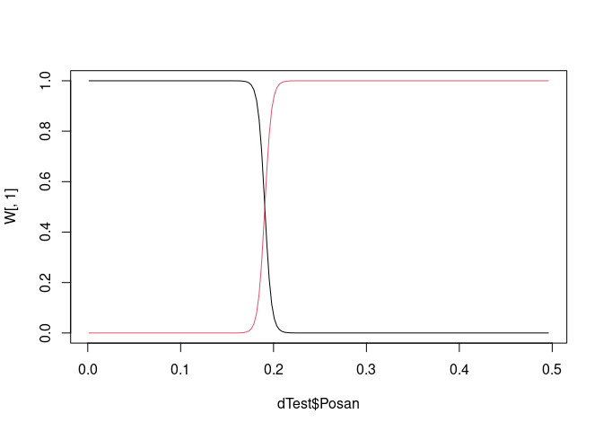
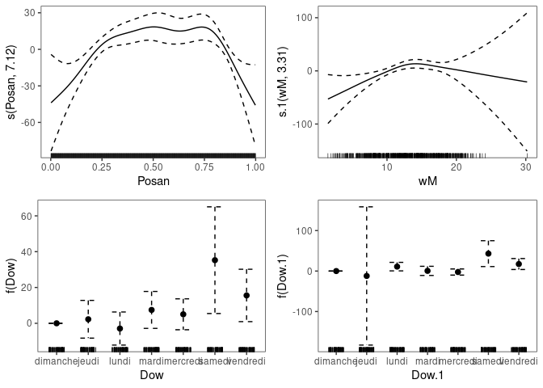
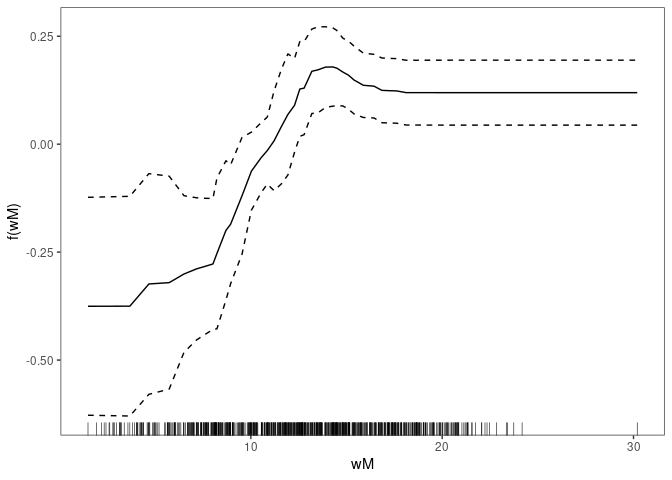

<style>
body {
text-align: justify}
</style>
At the moment this package simply offers a new family for performing
additive stacking in `mgcv`, but in the future it will be expanded to
provide tools for building more general GAM models.

### Probabilistic additive stacking

Probabilistic additive stacking is a semi-parametric extension of
regression stacking (Breiman, 1996), proposed by Capezza et al. (2020).
The idea is to created a mixture of experts, where the weight of each
expert depends on the covariates via parametric, random or smooth
effect. See the paper for more details.

Here we illustrate how to use additive stacking on a very simple
example. Consider the UK electricity demand data contained in the `qgam`
package:

``` r
library(qgam)
data(UKload)
head(UKload)
```

    ##     NetDemand       wM   wM_s95       Posan      Dow      Trend NetDemand.48 Holy Year                Date
    ## 25      38353 6.046364 5.558800 0.001369941   samedi 1293879600        38353    1 2011 2011-01-01 12:00:00
    ## 73      41192 2.803969 3.230582 0.004109824 dimanche 1293966000        38353    0 2011 2011-01-02 12:00:00
    ## 121     43442 2.097259 1.858198 0.006849706    lundi 1294052400        41192    0 2011 2011-01-03 12:00:00
    ## 169     50736 3.444187 2.310408 0.009589588    mardi 1294138800        43442    0 2011 2011-01-04 12:00:00
    ## 217     50438 5.958674 4.724961 0.012329471 mercredi 1294225200        50736    0 2011 2011-01-05 12:00:00
    ## 265     50064 4.124248 4.589470 0.015069353    jeudi 1294311600        50438    0 2011 2011-01-06 12:00:00

Here `NetDemand` is the aggregate electricity demand, `wM` is the
external temperature, `Dow` is the day of the week (in French) and
`Posan` is the time of year (0 on Jan 1st, 1 on Dec 31st). See `?UKload`
for a description of the other variables. Let us divide the model
between a training, a stacking and a testing set:

``` r
dTrain <- subset(UKload, Year <= 2013)
dStack <- subset(UKload, Year > 2013 & Year <= 2015)
dTest  <- subset(UKload, Year == 2016)
```

A very basic generalised additive model (GAM) model for the demand
*y*<sub>*t*</sub> might be
*y*<sub>*t*</sub> ∼ *N*(*μ*<sub>*t*</sub>, *σ*) where:
*μ*<sub>*t*</sub> = *β*<sub>0</sub> + *ψ*(Dow<sub>*t*</sub>) + *f*(wM<sub>*t*</sub>),
 where *ψ*(Dow<sub>*t*</sub>) is a parametric factor effect and
*f*(wM<sub>*t*</sub>) is a smooth effect. We can fit this model with
`mgcv` by doing

``` r
fitBasic <- gam(NetDemand ~ Dow + s(wM), data = dTrain)
```

In most countries, demand dynamics strongly depends on the time of year.
Hence it is possible that a model fitted only on the (summer) winter
data would perform better in the (summer) winter than a model fitted on
all the data, as above. Let us fit the season specific models as follow:

``` r
fitWinter <- gam(NetDemand ~ Dow + s(wM), data = subset(dTrain, Posan < 0.25 | Posan > 0.75))
fitSummer <- gam(NetDemand ~ Dow + s(wM), data = subset(dTrain, Posan >= 0.25 & Posan <= 0.75))
```

We have divided the data in a summer and a winter model, but we would
like to be able to transition smoothly between the two models when
predicting electricity demand on the test set. We can do this by
creating a mixture distribution which changes smoothly with `Posan`. To
do this via probabilistic stacking, we first need to evaluate the
probabilistic predictive log-densities of the two models on the stacking
set:

``` r
pW <- predict(fitWinter, newdata = dStack)
pS <- predict(fitSummer, newdata = dStack)
denW <- dnorm(dStack$NetDemand, pW, sqrt(fitWinter$sig2), log = TRUE)
denS <- dnorm(dStack$NetDemand, pS, sqrt(fitSummer$sig2), log = TRUE)
logP <- cbind(denW, denS)
```

The (second) first column of the matrix `logP` contains the a Gaussian
log-density, with parameters estimated under the (summer) winter model,
evaluated at the demand observations contained in the stacking set. Then
we use additive stacking to create a mixture of the two densities, which
varies smoothly with the time of year:

``` r
library(gamFactory)
fitStack <- gam(list(NetDemand ~ s(Posan)), data = dStack, family = fam_stackProb(logP))
```

The following plot:

``` r
plot(fitStack)
```


shows that the weight of the summer model is higher is the summer than
in the winter, as one would expect. See Capezza et al. (2020) for more
details on the particular parametrization used by the stacking family.

Let’s see whether the stacking model is any better than the initial
basic model. First we extract the model weights on the test set

``` r
W <- predict(fitStack, newdata = dTest, type = "response")
plot(dTest$Posan, W[ , 1], type = 'l') # Winter
lines(dTest$Posan, W[ , 2], col = 2)   # Summer
```


The weights must sum to one at each observation. Now we evaluate the
log-density of each model on the test set:

``` r
pBasic_t <- predict(fitBasic, newdata = dTest)
pW_t <- predict(fitWinter, newdata = dTest)
pS_t <- predict(fitSummer, newdata = dTest)
denBasic_t <- dnorm(dTest$NetDemand, pBasic_t, sqrt(fitBasic$sig2), log = TRUE)
denW_t <- dnorm(dTest$NetDemand, pW_t, sqrt(fitWinter$sig2), log = TRUE)
denS_t <- dnorm(dTest$NetDemand, pS_t, sqrt(fitSummer$sig2), log = TRUE)
```

The log-density of the stacking mixture is:

``` r
denMix_t <- log( W[ , 1] * exp(denW_t) + W[ , 2] * exp(denS_t) )
```

Let us compare the log-density (the log-likelihood) of the stacking and
the basic model on the test set:

``` r
plot(dTest$Posan, denMix_t, type = 'l') # Stacking
lines(dTest$Posan, denBasic_t, col = 2) # Basic
```


The higher the better, hence stacking seems to be sligthly doing better
here. Obviously this is a fairly dumb example, whose only purpose is to
illustrate how additive stacking works.

Note the `fam_stackProb` family can be used to create mixtures of more
than two experts. For example, we could get the log-density of the basic
model on the stacking set:

``` r
pBasic <- predict(fitBasic, newdata = dStack)
denBasic <- dnorm(dStack$NetDemand, pBasic, sqrt(fitBasic$sig2), log = TRUE)
```

build a matrix of predictive densities with three columns:

``` r
logP <- cbind(denW, denS, denBasic)
```

and fit a stacking mixture of three experts

``` r
fitStack2 <- gam(list(NetDemand ~ Dow + s(Posan),
                      NetDemand ~ Dow + s(wM)), 
                 data = dStack, family = fam_stackProb(logP))
```

Here we need to two model formulas, because we have three experts (the
parametrisation used is the same as that adopted in multinomial
regression). We can plot the covariates effects on the weights using the
methods provided by `mgcViz` (Fasiolo et al, 2019):

``` r
library(mgcViz)
fitStack2 <- getViz(fitStack2)
print(plot(fitStack2, allTerms = TRUE), pages = 1)
```


As explained in Capezza et al. (2020), accumulated local effect plot
often provide a better way to visualise the effect of covariate on the
experts weights:

``` r
plot(ALE(fitStack2, x = "wM", oind = 3, type = "response"))
```


The ALE plot shows how the weigth of the third model in the mixture
(`fitBasic`) changes with the temperature.

### References

-   Breiman, L. (1996). Stacked regressions. Machine learning 24 (1),
    49–64.

-   Capezza, C., Palumbo, B., Goude, Y., Wood, S. N. and Fasiolo, M.
    (2020). Additive stacking for disaggregate electricity demand
    forecasting.

-   Fasiolo, M., R. Nedellec, Y. Goude, and S. N. Wood (2020). Scalable
    Visualisation meth- ods for modern generalized additive models.
    Journal of Computational and Graphical Statistics 29 (1), 78–86.
