# gamFactory: GAMs with nested effects

**NOTE**: the `gamFactory` package is not on CRAN yet, and should be installed from GitHub via:

```r
library(devtools)
install_github("mfasiolo/gamFactory")
```
To visualise the effects of the models we will use a development version of the `mgcViz` package, which is also not on CRAN but can be installed via:

```r
install_github("mfasiolo/mgcViz")
```

## Introduction to nested effects

The `gamFactory` `R` package extends `mgcv` by providing a new class of smooth effects, the so-called nested effects.
These are smooth effects that take as argument a transformation of the covariates. To define them more precisely, let:  

   - $x \in \mathbb{R}^d$ be a vector of features or covariates.

   - $\tilde{s}(x): \mathbb{R}^d \rightarrow \mathbb{R}$ be a scalar-valued covariate transformation.
   
Then a smooth effect with a nested transformation is $s(\tilde{s}({ x}))$, where $s(\cdot)$ is a smooth effect built via a spline basis expansion.

Nested effect can be used in standard or multi-parameter GAMs (the latter include the GAMLSS models of Rigby and Stasinopoulos, 2005). In particular, assume that the conditional distribution of the response $y$ given the covariates ${ x}$ is

,%20\theta_2({%20x}),%20\dots,%20\theta_p({%20x})))

then the model for the $j$-th parameter of the distribution is

)%20=%20\sum_{k=1}^m%20f_k({%20x})%20%20+%20\sum_{u=1}^l%20s_u(\tilde{s}_u({%20x})))

where the $f_k$'s are standard smooth effects and the $s_u$'s are smooth effects with nested transformations (henceforth **nested effects**).

## Available types of nested effects

The `gamFactory` package provides several types of nested effects, each based on a different nested
transformation. They can be specified via

```r
s_nest(..., trans, k, m, sarg)
```
where `...` should contain the name of the covariate to be transformed, `trans` is the transformation to be nested, `k` is the number of basis functions to be used for the smooth effect, `m` is the order of the derivative to be penalised by the smoothing penalty and `sarg` is a list of arguments to be passed to the `s` function of `mgcv`.

Here we list the transformations currently available:

**Linear combinations**: use `trans = trans_linear()` a **single index** smooth effect. In particular, if ${ x} = (x_1, x_2, \dots, x_d)^T$, then this specifies a nested effect of the form

$$s(\tilde{s}({ x})) = s( a^T  x),$$

where $ a$ are the coefficients of the linear combination.

**Adaptive exponential smoothing**: These are obtained with `trans = trans_nexpsm()`. For example, suppose that ${ x} = (x_1, x_2, \dots, x_t, \dots, x_T)$ is time-ordered. Then this specifies a nested effect of the form 

)%20=%20s(\omega\tilde{s}(x_{t-1})%20+%20(1-\omega)x_{t}))

with $\omega \in (0, 1)$. Adaptive smoothing is achieved by modelling the exponential smoothing coefficient via
$$\omega_t = \phi(  { a}^T { z}_t ),$$
where $\phi(\cdot)$ is the standard logistic function, ${ z}_t$ is a vector of covariates and ${ a}$ is a vector of unknown parameters.

**multivariate kernel smoothing**: specified via `trans = trans_mgks()`. For example, suppose that response variable $y_i$ (e.g., ozone concentration) corresponds to location $ z_i^0$ and that we think that it depends on air temperature. We have temperature measurements $\text{temp}_1, \dots, \text{temp}_L$ at locations $ z_1, \dots,  z_L$, but none corresponds to $ z_i^0$. Then we can use `trans_mgks()` to build an estimate of the temperature at $ z_i^0$ via kernel smoothing, that is

%20=%20\frac{\sum_{l%20=%201}^L%20w_l%20\text{temp}_l}{\sum_{l%20=%201}^L%20w_l})

and

))

where $a > 0$ is the kernel smoothing parameter and $\text{dist}(\cdot, \cdot)$ is a distance function. The latter can be vector-valued, in which case $ a$ will be a vector of positive kernel smoothing coefficients.

## Building and fitting models with nested effects

The package provides a specialised `gam_nl()` extension of `mgcv::gam()` which allows to include nested effects in the model formula. The function

```r
 gam_nl(formula, family = fam_gaussian(), data = list(), fit = TRUE, ...)
```
takes the following arguments:

   - `formula` is a formula object, as in `mgcv::gam()`, but it can contain nested effects.

   - `family` is a family object specifying the distribution and link to use in fitting. Available families are Gaussian (`fam_gaussian`), binomial (`fam_binomial`), generalised Pareto distribution (`fam_gpd`), Poisson (`fam_poisson`) and Sinh-Arsinh (`fam_shash`).

   - `data` is a data frame or list that includes the model's response variable along with the covariates specified in the formula.

   - `fit` same argument as in `mgcv::gam`. If this argument is `TRUE` then `gam_nl` sets up the model and fits it, but if it is `FALSE` then the model is set up and an object containing what would be required to fit is returned.

   - `...` are additional arguments to be passed to `mgcv::gam()`.

Here is a simple example featuring a single index effect. We first simulate some data:

```r
set.seed(6436)
n <- 1000; p <- 3; b <- 1:p

X <- matrix(runif(p * n), ncol = p)
Xb <- X %*% b
f_true <- 2 * sin(Xb)
y <- f_true + rnorm(n)
dat <- data.frame(y = y)
dat$X <- X

plot(Xb, y, col = "grey")
lines(sort(Xb), f_true[order(X %*% b)], col = "red", lwd = 2)
```

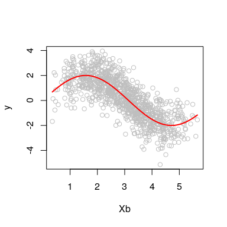
Then we fit a Gaussian model with a single index effect and a standard effect:


```r
library(gamFactory)

fit <- gam_nl(list(y ~ s_nest(X, trans = trans_linear()), ~ 1),
              data = dat, family = fam_gaussian())
```
We can call `summary` or `AIC` on the fitted model:

```r
summary(fit)
```

```
## 
## Family: gaussian_nl 
## Link function: identity loginva(0.01) 
## 
## Formula:
## y ~ s_nest(X, trans = trans_linear())
## ~1
## 
## Parametric coefficients:
##               Estimate Std. Error z value Pr(>|z|)    
## (Intercept)    0.44690    0.05862   7.624 2.46e-14 ***
## (Intercept).1 -0.02906    0.02260  -1.286    0.199    
## ---
## Signif. codes:  0 '***' 0.001 '**' 0.01 '*' 0.05 '.' 0.1 ' ' 1
## 
## Approximate significance of smooth terms:
##             edf Ref.df Chi.sq p-value    
## s_nest(X) 8.269  8.783   1897  <2e-16 ***
## ---
## Signif. codes:  0 '***' 0.001 '**' 0.01 '*' 0.05 '.' 0.1 ' ' 1
## 
## 
## -REML = 1426.2  Scale est. = 1         n = 1000
```

```r
AIC(fit)
```

```
## [1] 2821.816
```
We can also produce predictions:

```r
f_hat <- predict(fit)[ , 1]
plot(f_true, f_hat, xlab = "True mean", ylab = "Estimated mean")
abline(0, 1, col = 2)
```

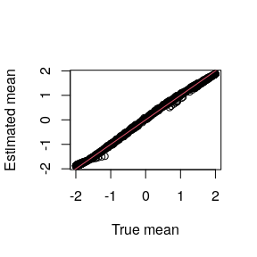
which looks roughly correct here.

The standard plotting methods of `mgcv` can be used on the model, but the nested effects are not plotted by default. To plot them, we can use the methods provided by `mgcViz` (development version, see the top of this document):

```r
library(mgcViz)

fit <- getViz(fit)

print(plot(fit), pages = 1)
```


On the left, the overall effect of the linear combination of the columns of `X` is being plotted. To plot the coefficients of the linear combination, we must do:

```r
print(plot(fit, inner = TRUE), pages = 1)
```


## Example: Chicago air pollution data

Here we consider the `chicago` dataset from the `gamair` package.

```r
library(gamair)
data(chicago)
head(chicago)
```

```
##   death pm10median pm25median  o3median  so2median    time tmpd
## 1   130 -7.4335443         NA -19.59234  1.9280426 -2556.5 31.5
## 2   150         NA         NA -19.03861 -0.9855631 -2555.5 33.0
## 3   101 -0.8265306         NA -20.21734 -1.8914161 -2554.5 33.0
## 4   135  5.5664557         NA -19.67567  6.1393413 -2553.5 29.0
## 5   126         NA         NA -19.21734  2.2784649 -2552.5 32.0
## 6   130  6.5664557         NA -17.63400  9.8585839 -2551.5 40.0
```
The data set contains daily measurements of air pollution and mortality in Chicago. Before modelling the data with `gamFactory` we load a pre-processed version of the data, which has no missing values and follows the format requirements needed by the nested effects which will be used below. The modified data is obtained via `chicago_data` function:

```r
dat <- chicago_data() # Assumes "gamair" package is installed
```
The structure of the data frame is quite complex, let's start by looking at the following elements:

```r
head(dat[ , c("death", "time", "X")])
```

```
##    death    time   X.pm10     X.o3    X.so2
## 57   119 -2500.5 5.643834 4.174303 3.836722
## 58   100 -2499.5 7.276165 3.964401 4.224386
## 59   119 -2498.5 5.286074 2.891765 2.679323
## 60   123 -2497.5 3.455803 4.088069 2.164990
## 61   125 -2496.5 5.739562 4.706801 3.262747
## 62   124 -2495.5 5.379830 4.590277 2.402710
```

```r
dim(dat$X)
```

```
## [1] 4791    3
```
Here `death` is the number of deaths, `time` is a time counter, and `X` is a matrix of transformed pollutants (shifted and the square-rooted to reduce right-skewness).

### A single index model

We fit a Poisson GAM to the data, including a single index effect of three pollutants. Here we set `method = "efs"` to fit the model via the generalised Fellner-Schall iteration of Wood and Fasiolo (2017), which is faster (but occasionally less accurate) than the default BFGS optimiser:

```r
# Should take a couple of minutes to converge
fit_si <- gam_nl(death ~ s(time, k = 200) +
                   s_nest(X, trans = trans_linear()),
                 family = fam_poisson(),
                 data = dat,
                 method = "efs")
```
We can then look at the summary of the model:

```r
summary(fit_si)
```

```
## 
## Family: poisson_nl 
## Link function: log 
## 
## Formula:
## death ~ s(time, k = 200) + s_nest(X, trans = trans_linear())
## 
## Parametric coefficients:
##             Estimate Std. Error z value Pr(>|z|)    
## (Intercept)  4.73813    0.00215    2203   <2e-16 ***
## ---
## Signif. codes:  0 '***' 0.001 '**' 0.01 '*' 0.05 '.' 0.1 ' ' 1
## 
## Approximate significance of smooth terms:
##               edf Ref.df   Chi.sq p-value    
## s(time)   128.984 154.42 3072.704  <2e-16 ***
## s_nest(X)   6.747   7.68    1.873  <2e-16 ***
## ---
## Signif. codes:  0 '***' 0.001 '**' 0.01 '*' 0.05 '.' 0.1 ' ' 1
## 
## 
## -REML =  19011  Scale est. = 1         n = 4791
```
which shows that both effects are highly significant. We visualise the outer effects:

```r
fit_si <- getViz(fit_si)

print(plot(fit_si), pages = 1)
```

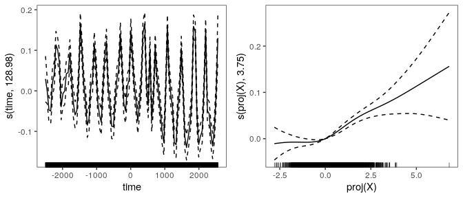
where the effect of time is using a lot of degrees of freedom, while the effects of the linear combination of pollutants is fairly smooth. The coefficients of the linear combination are plotted by:

```r
plot(fit_si, select = 2, inner = TRUE)
```

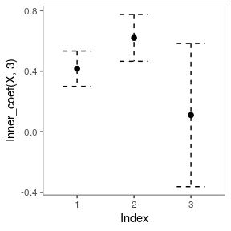
which suggests that the first two pollutants (`pm10` and `o3`) are important, while the third (`so.2`) is not. The coefficients are positive for `pm10` and `o3` which, considering that the effect of `proj(X)` is increasing, suggests that higher values of these pollutants are associated with higher mortality.

Some standard model checks can be performed by:

```r
check(fit_si)
```

```
## 
## Method: REML   Optimizer: outer newton
## full convergence after 11 iterations.
## Gradient range [-0.005414762,0.004639622]
## (score 19010.84 & scale 1).
## Hessian positive definite, eigenvalue range [1.09415,25.2387].
## Model rank =  213 / 213 
## 
## Basis dimension (k) checking results. Low p-value (k-index<1) may
## indicate that k is too low, especially if edf is close to k'.
## 
##             k'    edf k-index p-value    
## s(time) 199.00 128.98    0.91  <2e-16 ***
## s(X)     13.00   6.75      NA      NA    
## ---
## Signif. codes:  0 '***' 0.001 '**' 0.01 '*' 0.05 '.' 0.1 ' ' 1
```

```
## `stat_bin()` using `bins = 30`. Pick better value with `binwidth`.
```

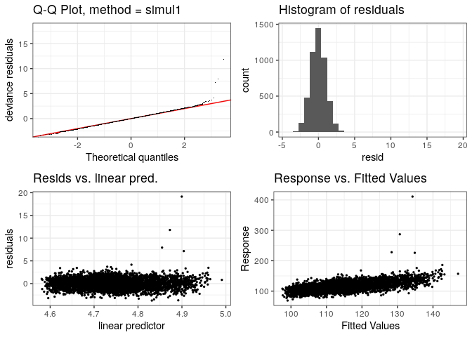
which show some large positive outliers (we do not examine this issue further here).

### Adding effects of exponentially smoothed `pm10` and `o3`

To verify whether exposure to high levels of `pm10` and `o3` for several days is associated with higher mortality, we can use the `trans_nexpsm()` transformation to build smooth effects of exponentially smoothed pollutants. To do this, we need to use the following elements of our data frame:

```r
head(dat$pm_10_lag)
```

```
##           y x x
## 56 6.703922 1 1
## 57 5.643834 1 1
## 58 7.276165 1 1
## 59 5.286074 1 1
## 60 3.455803 1 1
## 61 5.739562 1 1
```
here the first column contains lagged values of `pm10`, all the elements of the 2nd column are set to 1 and the third column contains the time differences between the current observed death count and the corresponding lagged value of `pm10`. Precisely the columns with `colnames` equal to `x` specify the elements of the $ z_t$ vector (see the explanations on `trans_nexpsm` above). Note the values on the third column:

```r
table(dat$pm_10_lag[ , 3])
```

```
## 
##    1    2    3    4    5    6 
## 4595  150   31    8    4    3
```
which means that most time differences are equal to 1 (one day lag) but are occasionally larger (up to 6 days).
The matrix `dat$o3_lag` has a similar structure.

With this data, we can fit a model with exponentially smoothed effects of `pm10` and `o3`:

```r
# Should take around 2 minutes:
fit_exp <- gam_nl(death ~ s(time, k = 200) +
                    s_nest(X, trans = trans_linear()) +
                    s_nest(pm_10_lag, trans = trans_nexpsm()) +
                    s_nest(o3_lag, trans = trans_nexpsm()),
                  family = fam_poisson(),
                  data = dat,
                  optimizer = "efs")
```
<!-- We can compare the current and the past model in terms of AIC: -->
<!-- ```{r} -->
<!-- AIC(fit_si, fit_exp) -->
<!-- ``` -->
<!-- Note that the latest model has more parameters, but less effective degrees of freedom (EDF).  -->
<!-- TOTALMENTE SBALLATI: DA CORREGGERE -->
<!-- This is because adding the exponentially smoothed effects has reduced the EDF neeeded to model the effect of time: -->
<!-- ```{r} -->
<!-- pen.edf(fit_si) -->
<!-- pen.edf(fit_exp) -->
<!-- ``` -->

We can visualise the outer effects as before:

```r
fit_exp <- getViz(fit_exp)
print(plot(fit_exp), pages = 1)
```

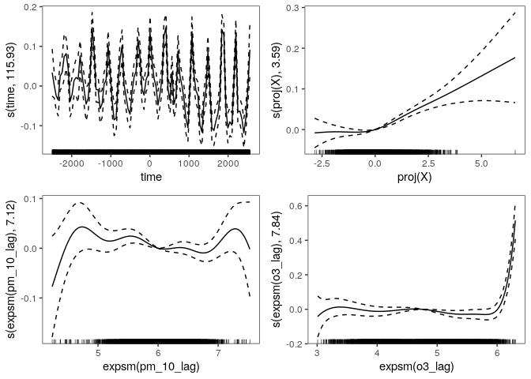
The effect of (exponential smoothed) `pm10` does not seem significant, while that of `o3` is positive at high pollutant levels.
We can look at the raw (grey points) and smoothed (lines) pollutants:

```r
pl1 <- plot(sm(fit_exp, 3), inner = TRUE) +
        l_points(colour = "grey", shape = 16) + l_fitLine()

pl2 <- plot(sm(fit_exp, 4), inner = TRUE) +
        l_points(colour = "grey", shape = 16) + l_fitLine()

gridPrint(pl1, pl2)
```

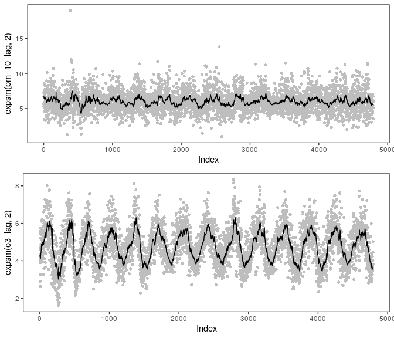
Note that the exponential smooth of `pm10` should not be over-interpreted, because the overall effect is not significant (hence
the amount of exponential smoothing is somewhat arbitrary).

### Using kernel rather than exponential smoothing

Given that the data considered here is time-ordered (i.e., we are dealing with time series) using an exponential smooth is more natural than using a kernel smooth. However, we can still use the latter to capture the effect of lagged pollutants' concentration.
To do so we need the following data:

```r
dim(dat$pm_10_lag_2)
```

```
## [1] 4791  100
```

```r
colnames(dat$pm_10_lag_2)
```

```
##   [1] "y"  "y"  "y"  "y"  "y"  "y"  "y"  "y"  "y"  "y"  "y"  "y"  "y"  "y"  "y"  "y"  "y"  "y"  "y"  "y"  "y"  "y"  "y"  "y"  "y" 
##  [26] "y"  "y"  "y"  "y"  "y"  "y"  "y"  "y"  "y"  "y"  "y"  "y"  "y"  "y"  "y"  "y"  "y"  "y"  "y"  "y"  "y"  "y"  "y"  "y"  "y" 
##  [51] "d1" "d1" "d1" "d1" "d1" "d1" "d1" "d1" "d1" "d1" "d1" "d1" "d1" "d1" "d1" "d1" "d1" "d1" "d1" "d1" "d1" "d1" "d1" "d1" "d1"
##  [76] "d1" "d1" "d1" "d1" "d1" "d1" "d1" "d1" "d1" "d1" "d1" "d1" "d1" "d1" "d1" "d1" "d1" "d1" "d1" "d1" "d1" "d1" "d1" "d1" "d1"
```
Here `dat$pm_10_lag_2` is a matrix, where each row contains 50 lagged values of `pm10` followed by 50 distances between the target day and the day corresponding to the lagged pollutant values. For example, this plot

```r
plot(dat$pm_10_lag_2[1, 51:100])
```

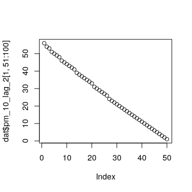
shows that the first observed death count in the data set will be modelled using the 50 lagged values of `pm10` with time-distances (time-lags in days) ranging from around 60 to 1 day. The matrix `dat$o3_lag_2` has a similar structure.

We can fit a model containing the effects of kernel smoothed `pm10` and `o3` as follows:

```r
# Takes around 2 minutes
fit_mgks <- gam_nl(death ~ s(time, k = 200) +
                    s_nest(X, trans = trans_linear()) +
                    s_nest(pm_10_lag_2, trans = trans_mgks()) +
                    s_nest(o3_lag_2, trans = trans_mgks()),
                  family = fam_poisson(), data = dat,
                  optimizer = "efs")
```

<!-- ```{r, echo = FALSE} -->
<!-- AIC(fit, fit_exp, fit_mgks) -->
<!-- ``` -->

We can plot the fitted effects as before:

```r
fit_mgks <- getViz(fit_mgks)

print(plot(getViz(fit_mgks)), pages = 1)
```

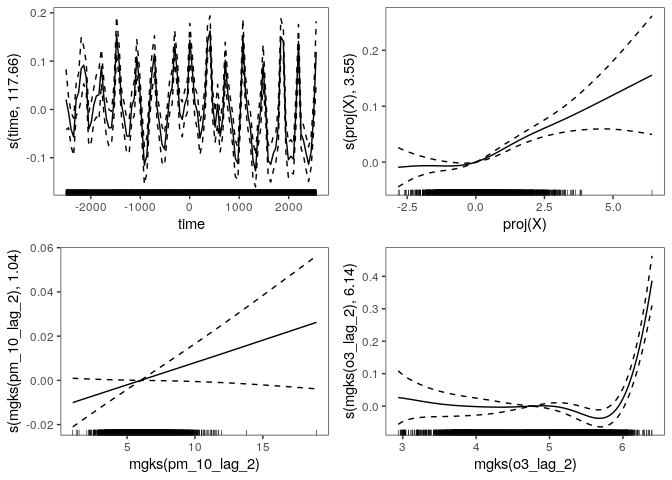
which shows that the overall effects are roughly similar to those obtained via exponential smoothing.
We can then compare the nested exponential and kernel smooths of pm10 and O3 (code not shown):
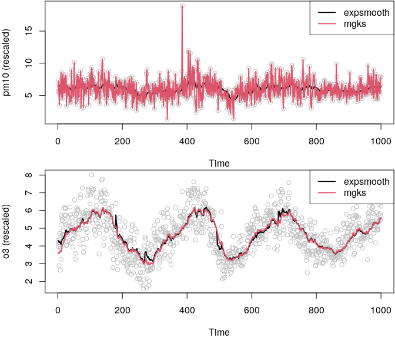
The smoothed O3 is quite similar across the two type of smooths, but the smoothed pm10 is quite different. This looks odd, but note that the overall effect of pm10 is not significant in both the exponential and the kernel smoothing model. Hence, the smoothed pm10 has a very weak effect on the Poisson rate of mortality, and the amount of exponential or kernel smoothing is somewhat arbitrary (i.e. is does not affect the overall fit).


# Probabilistic additive stacking

Probabilistic additive stacking is a semi-parametric extension of regression stacking (Breiman, 1996), proposed by Capezza et al. (2020). The idea is to create a mixture of experts, where the weight of each expert depends on the covariates via parametric, random or smooth effects. See the paper for more details.

The `gamFactory` package provides a new family of distributions, `fam_stackProb`, which can be used to fit models with probabilistic additive stacking. But **note that many more stacking methods** are provided by the `gamstackr` package, available [here](https://github.com/eenticott/gamstackr)

Here we illustrate how to use additive stacking on a very simple example. Consider the UK electricity demand data contained in the `qgam` package:

```r
library(qgam)
data(UKload)
head(UKload)
```

```
##     NetDemand       wM   wM_s95       Posan      Dow      Trend NetDemand.48 Holy Year                Date
## 25      38353 6.046364 5.558800 0.001369941   samedi 1293879600        38353    1 2011 2011-01-01 12:00:00
## 73      41192 2.803969 3.230582 0.004109824 dimanche 1293966000        38353    0 2011 2011-01-02 12:00:00
## 121     43442 2.097259 1.858198 0.006849706    lundi 1294052400        41192    0 2011 2011-01-03 12:00:00
## 169     50736 3.444187 2.310408 0.009589588    mardi 1294138800        43442    0 2011 2011-01-04 12:00:00
## 217     50438 5.958674 4.724961 0.012329471 mercredi 1294225200        50736    0 2011 2011-01-05 12:00:00
## 265     50064 4.124248 4.589470 0.015069353    jeudi 1294311600        50438    0 2011 2011-01-06 12:00:00
```
Here `NetDemand` is the aggregate electricity demand, `wM` is the external temperature, `Dow` is the day of the week (in French) and `Posan` is the time of year (0 on Jan 1st, 1 on Dec 31st). See `?UKload` for a description of the other variables.

Let us divide the model between a training, a stacking and a testing set:

```r
dTrain <- subset(UKload, Year <= 2013)
dStack <- subset(UKload, Year > 2013 & Year <= 2015)
dTest  <- subset(UKload, Year == 2016)
```
A very basic generalised additive model (GAM) for the demand $y_t$ might be $y_t \sim N(\mu_t,\sigma)$ with:
$$
\mu_t = \beta_0 + \psi(\text{Dow}_t) + f(\text{wM}_t),
$$
where $\psi(\text{Dow}_t)$ is a parametric factor effect and $f(\text{wM}_t)$ is a smooth effect. We can fit this model with `mgcv` by doing

```r
fitBasic <- gam(NetDemand ~ Dow + s(wM), data = dTrain)
```

In most countries, demand behaviour strongly depends on the time of year. Hence it is possible that a model fitted only to the (summer) winter data would perform better in the (summer) winter than a model fitted to all the data, as above. Let us fit two season specific models:

```r
fitWinter <- gam(NetDemand ~ Dow + s(wM), data = subset(dTrain, Posan < 0.25 | Posan > 0.75))
fitSummer <- gam(NetDemand ~ Dow + s(wM), data = subset(dTrain, Posan >= 0.25 & Posan <= 0.75))
```
We have divided the data between a summer and a winter model, but we would like to be able to shift smoothly between the two models when we predict electricity demand on the test set. We can do this by creating a mixture distribution which changes smoothly with `Posan`. To do this via probabilistic stacking, we first need to evaluate the probabilistic predictive log-densities of the two models on the stacking set:

```r
pW <- predict(fitWinter, newdata = dStack)
pS <- predict(fitSummer, newdata = dStack)
denW <- dnorm(dStack$NetDemand, pW, sqrt(fitWinter$sig2), log = TRUE)
denS <- dnorm(dStack$NetDemand, pS, sqrt(fitSummer$sig2), log = TRUE)
logP <- cbind(denW, denS)
```
The (second) first column of the matrix `logP` contains a Gaussian log-density, with parameters estimated under the (summer) winter model, evaluated at the demand observations contained in the stacking set. Then, we use additive stacking to create a mixture of the two densities, which varies smoothly with the time of year:

```r
library(gamFactory)
fitStack <- gam(list(NetDemand ~ s(Posan)), data = dStack, family = fam_stackProb(logP))
```

The following plot:

```r
plot(fitStack)
```

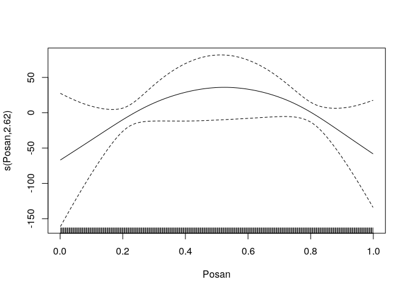
shows that the weight of the summer model is higher during the summer than during the winter, as one would expect. See Capezza et al. (2020) for more details on the particular parametrization used by the stacking family.

Let's see whether the stacking model is any better than the initial basic model. First, we extract the predicted experts' weights on the test set:

```r
W <- predict(fitStack, newdata = dTest, type = "response")
plot(dTest$Posan, W[ , 1], type = 'l', ylab = "Weights") # Winter
lines(dTest$Posan, W[ , 2], col = 2)   # Summer
```


The weights must sum to one at each observation. Now we evaluate the log-density of each model on the test set:

```r
pBasic_t <- predict(fitBasic, newdata = dTest)
pW_t <- predict(fitWinter, newdata = dTest)
pS_t <- predict(fitSummer, newdata = dTest)
denBasic_t <- dnorm(dTest$NetDemand, pBasic_t, sqrt(fitBasic$sig2), log = TRUE)
denW_t <- dnorm(dTest$NetDemand, pW_t, sqrt(fitWinter$sig2), log = TRUE)
denS_t <- dnorm(dTest$NetDemand, pS_t, sqrt(fitSummer$sig2), log = TRUE)
```
The log-density of the stacking mixture is:

```r
denMix_t <- log( W[ , 1] * exp(denW_t) + W[ , 2] * exp(denS_t) )
```
Let us compare the log-density (i.e., the log-likelihood) of the stacking and the basic model on the test set:

```r
plot(dTest$Posan, denMix_t, type = 'l') # Stacking
lines(dTest$Posan, denBasic_t, col = 2) # Basic
```


The higher the better, hence stacking seems to be doing slightly better than the basic GAM. Obviously, this is a fairly dumb example, whose only purpose is to illustrate how additive stacking works. For example, we have not excluded holidays and both models do badly on those days. In particular, on the plot we see very negative likelihood values on Jan 1st, around Easter and around the 1st May bank holiday.

Note that the `fam_stackProb` family can be used to create mixtures of more than two experts. For example, we could get the log-density of the basic model on the stacking set:

```r
pBasic <- predict(fitBasic, newdata = dStack)
denBasic <- dnorm(dStack$NetDemand, pBasic, sqrt(fitBasic$sig2), log = TRUE)
```
build a matrix of predictive densities with three columns (winter, summer and basic expert):

```r
logP <- cbind(denW, denS, denBasic)
```
and fit a stacking mixture of three experts:

```r
fitStack2 <- gam(list(NetDemand ~ Dow + s(Posan),
                      NetDemand ~ Dow + s(wM)),
                 data = dStack, family = fam_stackProb(logP))
```
Now we use two model formulas, because we have three experts (the parametrisation used by additive stacking is the same adopted in multinomial regression). We can plot the covariates effects on the weights using the methods provided by `mgcViz` (Fasiolo et al, 2019):

```r
library(mgcViz)
fitStack2 <- getViz(fitStack2)
print(plot(fitStack2, allTerms = TRUE), pages = 1)
```


As explained in Capezza et al. (2020), the accumulated local effect (ALE) plots of Apley and Zhu (2016) often provide a better way to visualise the effect of covariate on the experts weights:

```r
plot(ALE(fitStack2, x = "wM", oind = 3, type = "response"))
```

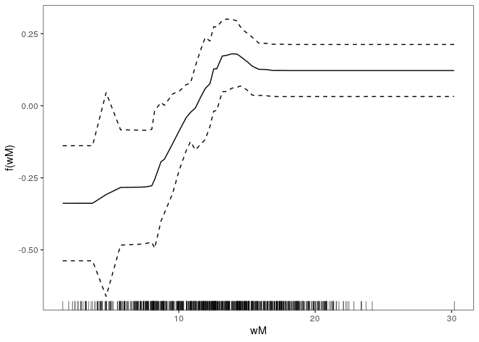
The ALE plot shows how the weight of the third model in the mixture (`fitBasic`) changes with the temperature.


# References

   - Apley, D.W. and Zhu, J., 2020. Visualizing the effects of predictor variables in black box supervised learning models. Journal of the Royal Statistical Society Series B: Statistical Methodology, 82(4), pp.1059-1086.

   - Breiman, L. (1996). Stacked regressions. Machine learning 24 (1), 49–64.

   - Capezza, C., Palumbo, B., Goude, Y., Wood, S.N. and Fasiolo, M., 2021. Additive stacking for disaggregate electricity demand forecasting. The Annals of Applied Statistics, 15(2), pp.727-746.

   - Fasiolo, M., R. Nedellec, Y. Goude, and S. N. Wood (2020). Scalable Visualisation methods for modern generalized additive models. Journal of Computational and Graphical
Statistics 29 (1), 78–86.

  - Rigby, R.A. and Stasinopoulos, D.M., 2005. Generalized additive models for location, scale and shape. Journal of the Royal Statistical Society Series C: Applied Statistics, 54(3), pp.507-554.

  - Wood, S. N. (2017). Generalized Additive Models: An Introduction with R. Chapman and Hall/CRC.

  - Wood, S.N. and Fasiolo, M., 2017. A generalized Fellner‐Schall method for smoothing parameter optimization with application to Tweedie location, scale and shape models. Biometrics, 73(4), pp.1071-1081.


