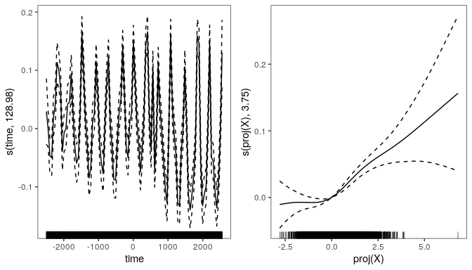
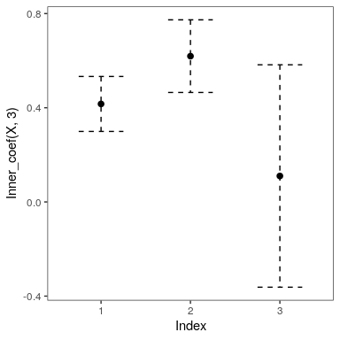
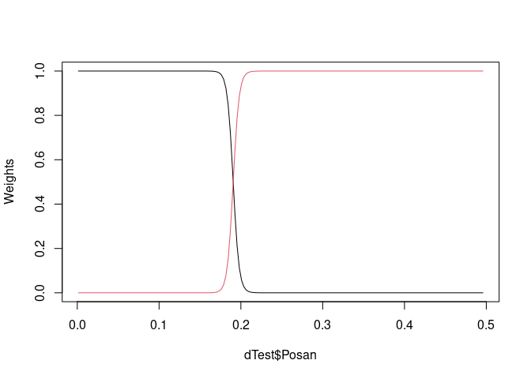
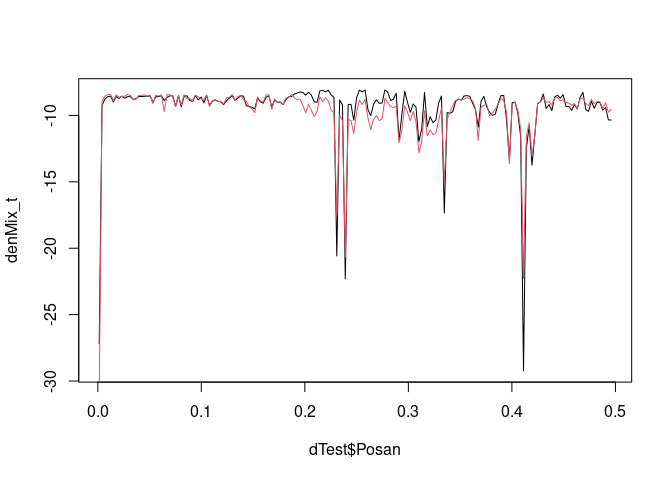
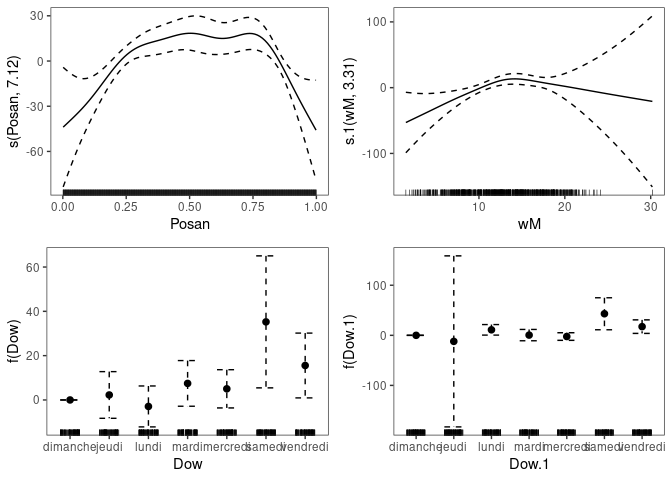
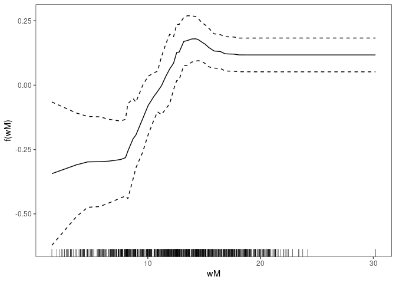

``` r
library(devtools)

install_github("mfasiolo/gamFactory")

install_github("mfasiolo/mgcViz")      
```

## Loading the processed data

``` r
library(gamFactory)
dat <- chicago_data() # Assumes "gamair" package is installed

head(dat[ , c("death", "time", "X")])
```

    ##    death    time   X.pm10     X.o3    X.so2
    ## 57   119 -2500.5 5.643834 4.174303 3.836722
    ## 58   100 -2499.5 7.276165 3.964401 4.224386
    ## 59   119 -2498.5 5.286074 2.891765 2.679323
    ## 60   123 -2497.5 3.455803 4.088069 2.164990
    ## 61   125 -2496.5 5.739562 4.706801 3.262747
    ## 62   124 -2495.5 5.379830 4.590277 2.402710

``` r
dim(dat$X)
```

    ## [1] 4791    3

## Fitting a Poisson GAMs with a single index effect

Fit the model (should take around 2 minutes):

``` r
fit <- gam_nl(death ~ s(time, k = 200) + 
                      s_nest(X, trans = trans_linear()), 
              family = fam_poisson(), 
              data = dat, 
              method = "efs") # Faster fitting with Extended Fellner-Schall
```

``` r
library(mgcViz)

fit <- getViz(fit)

print(plot(fit), pages = 1)
```



``` r
plot(fit, select = 2, inner = TRUE)
```



## Adding effects of exponentially smoothed pm10 and o3

``` r
dim(dat$pm_10_lag)
```

    ## [1] 4791    3

``` r
head(dat$pm_10_lag)
```

    ##           y x x
    ## 56 6.703922 1 1
    ## 57 5.643834 1 1
    ## 58 7.276165 1 1
    ## 59 5.286074 1 1
    ## 60 3.455803 1 1
    ## 61 5.739562 1 1

``` r
table(dat$pm_10_lag[ , 3])
```

    ## 
    ##    1    2    3    4    5    6 
    ## 4595  150   31    8    4    3

Fit the model (should take around 2 minutes):

``` r
fit_exp <- gam_nl(death ~ s(time, k = 200) + 
                    s_nest(X, trans = trans_linear()) + 
                    s_nest(pm_10_lag, trans = trans_nexpsm()) + # expsmooth
                    s_nest(o3_lag, trans = trans_nexpsm()),     # expsmooth
                  family = fam_poisson(),
                  data = dat,
                  optimizer = "efs")
```

``` r
fit_exp <- getViz(fit_exp)
print(plot(getViz(fit_exp)), pages = 1)
```


``` r
pl1 <- plot(sm(fit_exp, 3), inner = TRUE) + 
  l_points(colour = "grey", shape = 16) + l_fitLine()

pl2 <- plot(sm(fit_exp, 4), inner = TRUE) + 
  l_points(colour = "grey", shape = 16) + l_fitLine()

gridPrint(pl1, pl2)
```


## Using kernel rather than exponential smoothing

``` r
dim(dat$pm_10_lag_2)
```

    ## [1] 4791  100

``` r
colnames(dat$pm_10_lag_2)
```

    ##   [1] "y"  "y"  "y"  "y"  "y"  "y"  "y"  "y"  "y"  "y"  "y"  "y"  "y"  "y"  "y" 
    ##  [16] "y"  "y"  "y"  "y"  "y"  "y"  "y"  "y"  "y"  "y"  "y"  "y"  "y"  "y"  "y" 
    ##  [31] "y"  "y"  "y"  "y"  "y"  "y"  "y"  "y"  "y"  "y"  "y"  "y"  "y"  "y"  "y" 
    ##  [46] "y"  "y"  "y"  "y"  "y"  "d1" "d1" "d1" "d1" "d1" "d1" "d1" "d1" "d1" "d1"
    ##  [61] "d1" "d1" "d1" "d1" "d1" "d1" "d1" "d1" "d1" "d1" "d1" "d1" "d1" "d1" "d1"
    ##  [76] "d1" "d1" "d1" "d1" "d1" "d1" "d1" "d1" "d1" "d1" "d1" "d1" "d1" "d1" "d1"
    ##  [91] "d1" "d1" "d1" "d1" "d1" "d1" "d1" "d1" "d1" "d1"

``` r
unname(dat$pm_10_lag_2[1, 1:50])
```

    ##  [1] 5.562605 6.127772 6.628920 6.703922 6.159754 5.739562 6.148552 4.352307
    ##  [9] 4.789841 7.067006 6.320014 5.578539 3.992815 5.995213 5.379830 5.911225
    ## [17] 5.848393 6.995897 7.207120 5.911225 8.242729 6.205175 6.628920 5.651776
    ## [25] 7.479477 5.739562 6.730506 7.479477 5.941877 8.181844 7.742259 6.398639
    ## [33] 4.606095 6.240399 5.739562 8.941061 8.996809 5.995213 5.234093 2.990414
    ## [41] 3.307956 4.465711 4.893115 6.778095 8.590966 7.479477 6.553058 6.628920
    ## [49] 6.703922 6.703922

``` r
unname(dat$pm_10_lag_2[1, 51:100])
```

    ##  [1] 56 54 53 51 50 49 48 46 45 44 43 42 41 39 38 37 36 35 34 33 31 30 29 28 27
    ## [26] 26 24 23 22 21 20 19 18 17 16 15 14 13 12 11 10  9  8  7  6  5  4  3  2  1

Fit the model (takes around 2 minutes):

``` r
fit_mgks <- gam_nl(death ~ s(time, k = 200) + 
                    s_nest(X, trans = trans_linear()) + 
                    s_nest(pm_10_lag_2, trans = trans_mgks()) + # kernel smooth
                    s_nest(o3_lag_2, trans = trans_mgks()),     # kernel smooth
                  family = fam_poisson(), data = dat,
                  optimizer = "efs")
```

    ##                df      AIC
    ## fit      163.1043 37638.41
    ## fit_exp  144.4842 37361.88
    ## fit_mgks 136.3854 37464.76

``` r
fit_mgks <- getViz(fit_mgks)

print(plot(getViz(fit_mgks)), pages = 1)
```


Comparing the smooth PM10 and O3 across models (code not shown):


### Probabilistic additive stacking

Probabilistic additive stacking is a semi-parametric extension of
regression stacking (Breiman, 1996), proposed by Capezza et al. (2020).
The idea is to create a mixture of experts, where the weight of each
expert depends on the covariates via parametric, random or smooth
effects. See the paper for more details.

Here we illustrate how to use additive stacking on a very simple
example. Consider the UK electricity demand data contained in the `qgam`
package:

``` r
library(qgam)
data(UKload)
head(UKload)
```

    ##     NetDemand       wM   wM_s95       Posan      Dow      Trend NetDemand.48 Holy Year                Date
    ## 25      38353 6.046364 5.558800 0.001369941   samedi 1293879600        38353    1 2011 2011-01-01 12:00:00
    ## 73      41192 2.803969 3.230582 0.004109824 dimanche 1293966000        38353    0 2011 2011-01-02 12:00:00
    ## 121     43442 2.097259 1.858198 0.006849706    lundi 1294052400        41192    0 2011 2011-01-03 12:00:00
    ## 169     50736 3.444187 2.310408 0.009589588    mardi 1294138800        43442    0 2011 2011-01-04 12:00:00
    ## 217     50438 5.958674 4.724961 0.012329471 mercredi 1294225200        50736    0 2011 2011-01-05 12:00:00
    ## 265     50064 4.124248 4.589470 0.015069353    jeudi 1294311600        50438    0 2011 2011-01-06 12:00:00

Here `NetDemand` is the aggregate electricity demand, `wM` is the
external temperature, `Dow` is the day of the week (in French) and
`Posan` is the time of year (0 on Jan 1st, 1 on Dec 31st). See `?UKload`
for a description of the other variables.

Let us divide the model between a training, a stacking and a testing
set:

``` r
dTrain <- subset(UKload, Year <= 2013)
dStack <- subset(UKload, Year > 2013 & Year <= 2015)
dTest  <- subset(UKload, Year == 2016)
```

A very basic generalised additive model (GAM) for the demand \(y_t\)
might be \(y_t \sim N(\mu_t,\sigma)\) with: \[
\mu_t = \beta_0 + \psi(\text{Dow}_t) + f(\text{wM}_t),
\] where \(\psi(\text{Dow}_t)\) is a parametric factor effect and
\(f(\text{wM}_t)\) is a smooth effect. We can fit this model with `mgcv`
by doing

``` r
fitBasic <- gam(NetDemand ~ Dow + s(wM), data = dTrain)
```

In most countries, demand behaviour strongly depends on the time of
year. Hence it is possible that a model fitted only to the (summer)
winter data would perform better in the (summer) winter than a model
fitted to all the data, as above. Let us fit two season specific
models:

``` r
fitWinter <- gam(NetDemand ~ Dow + s(wM), data = subset(dTrain, Posan < 0.25 | Posan > 0.75))
fitSummer <- gam(NetDemand ~ Dow + s(wM), data = subset(dTrain, Posan >= 0.25 & Posan <= 0.75))
```

We have divided the data between a summer and a winter model, but we
would like to be able to shift smoothly between the two models when we
predict electricity demand on the test set. We can do this by creating a
mixture distribution which changes smoothly with `Posan`. To do this via
probabilistic stacking, we first need to evaluate the probabilistic
predictive log-densities of the two models on the stacking set:

``` r
pW <- predict(fitWinter, newdata = dStack)
pS <- predict(fitSummer, newdata = dStack)
denW <- dnorm(dStack$NetDemand, pW, sqrt(fitWinter$sig2), log = TRUE)
denS <- dnorm(dStack$NetDemand, pS, sqrt(fitSummer$sig2), log = TRUE)
logP <- cbind(denW, denS)
```

The (second) first column of the matrix `logP` contains a Gaussian
log-density, with parameters estimated under the (summer) winter model,
evaluated at the demand observations contained in the stacking set.
Then, we use additive stacking to create a mixture of the two densities,
which varies smoothly with the time of year:

``` r
library(gamFactory)
fitStack <- gam(list(NetDemand ~ s(Posan)), data = dStack, family = fam_stackProb(logP))
```

The following
plot:

``` r
plot(fitStack)
```


shows that the weight of the summer model is higher during the summer
than during the winter, as one would expect. See Capezza et al. (2020)
for more details on the particular parametrization used by the stacking
family.

Let’s see whether the stacking model is any better than the initial
basic model. First, we extract the predicted experts’ weights on the
test set:

``` r
W <- predict(fitStack, newdata = dTest, type = "response")
plot(dTest$Posan, W[ , 1], type = 'l', ylab = "Weights") # Winter
lines(dTest$Posan, W[ , 2], col = 2)   # Summer
```


The weights must sum to one at each observation. Now we evaluate the
log-density of each model on the test set:

``` r
pBasic_t <- predict(fitBasic, newdata = dTest)
pW_t <- predict(fitWinter, newdata = dTest)
pS_t <- predict(fitSummer, newdata = dTest)
denBasic_t <- dnorm(dTest$NetDemand, pBasic_t, sqrt(fitBasic$sig2), log = TRUE)
denW_t <- dnorm(dTest$NetDemand, pW_t, sqrt(fitWinter$sig2), log = TRUE)
denS_t <- dnorm(dTest$NetDemand, pS_t, sqrt(fitSummer$sig2), log = TRUE)
```

The log-density of the stacking mixture is:

``` r
denMix_t <- log( W[ , 1] * exp(denW_t) + W[ , 2] * exp(denS_t) )
```

Let us compare the log-density (i.e., the log-likelihood) of the
stacking and the basic model on the test set:

``` r
plot(dTest$Posan, denMix_t, type = 'l') # Stacking
lines(dTest$Posan, denBasic_t, col = 2) # Basic
```


The higher the better, hence stacking seems to be doing sligthly better
than the basic GAM. Obviously this is a fairly dumb example, whose only 
purpose is to illustrate how additive stacking works. For example, we 
have not excluded holidays and both models do badly on those days. In 
particular, on the plot we see very negative likelihood values on Jan 
1st, around Easter and around the 1st May bank holiday. 

Note that the `fam_stackProb` family can be used to create mixtures of
more than two experts. For example, we could get the log-density of the
basic model on the stacking set:

``` r
pBasic <- predict(fitBasic, newdata = dStack)
denBasic <- dnorm(dStack$NetDemand, pBasic, sqrt(fitBasic$sig2), log = TRUE)
```

build a matrix of predictive densities with three columns (winter,
summer and basic expert):

``` r
logP <- cbind(denW, denS, denBasic)
```

and fit a stacking mixture of three experts:

``` r
fitStack2 <- gam(list(NetDemand ~ Dow + s(Posan),
                      NetDemand ~ Dow + s(wM)), 
                 data = dStack, family = fam_stackProb(logP))
```

Now we use two model formulas, because we have three experts (the
parametrisation used by additive stacking is the same adopted in
multinomial regression). We can plot the covariates effects on the
weights using the methods provided by `mgcViz` (Fasiolo et al, 2019):

``` r
library(mgcViz)
fitStack2 <- getViz(fitStack2)
print(plot(fitStack2, allTerms = TRUE), pages = 1)
```


As explained in Capezza et al. (2020), the accumulated local effect
(ALE) plot of Apley and Zhu (2016) often provide a better way to
visualise the effect of covariate on the experts
weights:

``` r
plot(ALE(fitStack2, x = "wM", oind = 3, type = "response"))
```


The ALE plot shows how the weight of the third model in the mixture
(`fitBasic`) changes with the temperature.

### References

  - Apley, D. W. and J. Zhu (2016). Visualizing the effects of predictor
    variables in black box supervised learning models. arXiv preprint
    arXiv:1612.08468 .

  - Breiman, L. (1996). Stacked regressions. Machine learning 24 (1),
    49–64.

  - Capezza, C., Palumbo, B., Goude, Y., Wood, S. N. and Fasiolo, M.
    (2020). Additive stacking for disaggregate electricity demand
    forecasting.

  - Fasiolo, M., R. Nedellec, Y. Goude, and S. N. Wood (2020). Scalable
    Visualisation methods for modern generalized additive models.
    Journal of Computational and Graphical Statistics 29 (1), 78–86.
